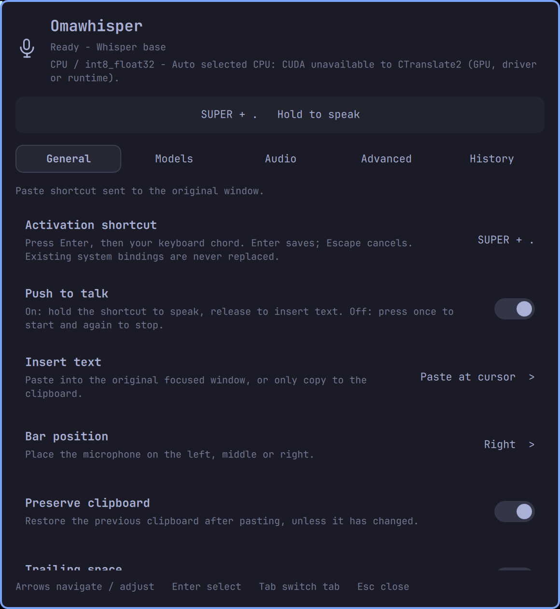
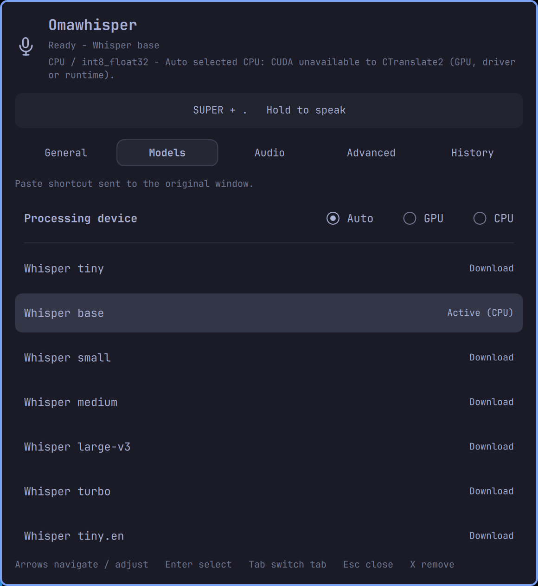

# Omawhisper

Local voice dictation for the **Omarchy bar**. Hold a shortcut, speak, and
release to insert text where you're typing. The microphone becomes a live audio
meter while you speak; click it to open settings.

| General | Models |
| :-----: | :----: |
|  |  |

## Features

- **Push to talk** by default, with an optional press-to-toggle mode.
- **Whisper and Parakeet**, with one-click model downloads and CPU or NVIDIA GPU processing.
- **Custom models and engines** through compatible model repositories, local weights, or command adapters.
- **Keyboard-first settings**, configurable shortcuts, and left / center / right bar placement.

## Install

Requires Omarchy's Quickshell bar, Hyprland with Lua configuration, PipeWire,
`wl-clipboard`, Python, and systemd user services.

```bash
git clone https://github.com/mohamedmansour/omawhisper.git
cd omawhisper
./scripts/install.sh
```

The installer sets up the plugin, isolated speech runtimes, and a local background
service. It does not install GPU drivers or replace existing shortcuts.
Use this installer rather than only `omarchy plugin add`: dictation needs the service.

## Use

1. Click the microphone and open **Models**.
2. Choose **Auto**, **GPU**, or **CPU**, then click a model to download and load it.
3. Focus a text input. Hold **Super + Alt + V** (the default shortcut), speak, and release.

Transcription processes the complete recording after release, then pastes into
the original window. If focus changes, the text stays available in **History**
instead of being pasted elsewhere. Middle-click the microphone to cancel.

Under **General > Activation shortcut**, press your new combination, then **Enter**
to save. Punctuation such as **Super + .** works; conflicting system bindings are
rejected. Turn off **Push to talk** to press once to start and again to stop.

## Settings

| Tab | Controls |
| --- | --- |
| General | Shortcut, push to talk, paste / clipboard output, bar position |
| Models | Processing device and one-click model download / activation |
| Audio | Microphone, language, translation, silence detection |
| Advanced | Custom models, precision, decoding, paste behavior, optional history |
| History | Copy the latest transcript, browse or clear saved history |

**Up/Down** moves between rows; **Left/Right** changes a value or the selected tab.
**Enter** selects or saves, **Tab/Shift+Tab** changes tabs (or saves and moves between
rows while editing), and **Escape** cancels or closes. In Models, **X** then **Enter**
removes a model. Click a model's progress row again to cancel its download or load.

## Models and GPU

**Auto** prefers supported NVIDIA CUDA acceleration; **GPU** requires it and never
silently falls back to CPU. A working NVIDIA driver is required; optional runtime
libraries are installed when you select a model.

For Parakeet, choose **INT8 for CPU** or **FP32 for GPU**. FP32 needs substantially
more memory (about 5 GiB of host RAM to load). Custom weights must match their engine;
arbitrary Whisper.cpp, MLX, or NeMo files are not interchangeable.

See the [advanced guide](docs/advanced.md) for GPU requirements, custom adapters,
troubleshooting, storage locations, development, and removal.

## Privacy

Built-in transcription stays on your machine. Temporary recordings are deleted
after processing or cancellation. **Saved history is off by default**; the latest
transcript remains in memory. Your clipboard manager may retain pasted text.
Model and runtime downloads require internet access; custom adapters have their own
data-handling behavior.

## Update

From your checkout:

```bash
git pull --ff-only
./scripts/install.sh
```

The installer defaults to the right side of the bar; add `--section left` or
`--section center` to retain a custom placement. Models, settings, and history are kept.

## Credits and license

Inspired by [OpenSuperWhisper](https://github.com/Starmel/OpenSuperWhisper) and
[Omafinance](https://github.com/mohamedmansour/omafinance). MIT licensed;
speech models and third-party runtimes retain their own licenses.
